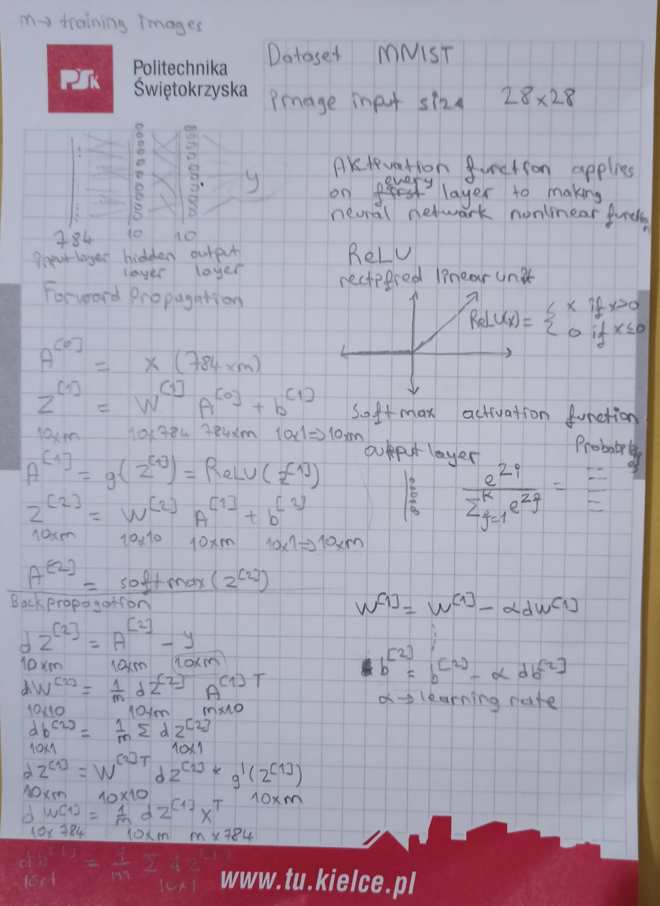

# Neural Network for MNIST Dataset

This repository contains a neural network implementation from scratch for the MNIST dataset. The MNIST dataset is a widely used benchmark dataset for handwritten digit recognition.

## Installation

To use this code, follow these steps:

1. Clone the repository:

    ```shell
    git clone git@github.com:Alperenlcr/Neural_Network_from_scratch.git
    ```

2. Install the required dependencies:

    ```shell
    pip install numpy pandas pillow matplotlib
    ```

3. Download the MNIST dataset from [here](https://www.kaggle.com/datasets/playlist/mnistzip) and specify the path in notebook.

## Usage

To train and evaluate the neural network, run the notebook.

## Layers and Math:

The neural network consists of the following layers:

1. Input Layer: The input layer receives the input data, which in this case is the pixel values of the handwritten digits in the MNIST dataset.

2. Hidden Layers: There can be one or more hidden layers in the neural network. Each hidden layer consists of a set of neurons that perform computations on the input data.

3. Output Layer: The output layer produces the final output of the neural network, which in this case is the predicted digit.

The math behind the neural network involves various calculations, such as matrix multiplications, activation functions, and error calculations. These calculations are performed iteratively during the training process to optimize the network's weights and biases.

Below is the simple architecture:

